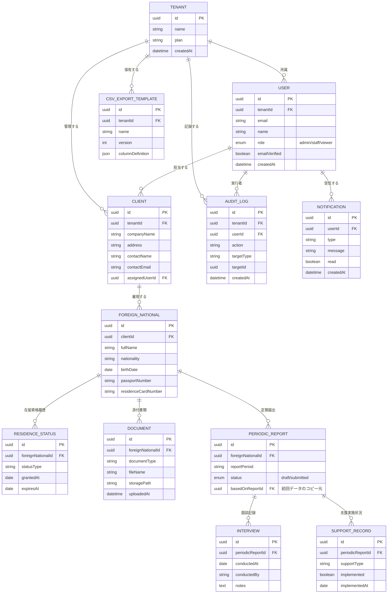

# 概念データモデル（ER図）

> 本ドキュメントは概念設計であり、Prismaスキーマとしての詳細な型・制約・インデックス設計は
> Phase2（データベース設計）で確定する。

## 1. マルチテナント方針

本サービスは行政書士事務所・登録支援機関ごとにデータを分離するマルチテナントSaaSとする。

- **Tenant**: サービス契約単位（1つの行政書士事務所/登録支援機関/受入企業）
- **User**: Tenantに所属するログインユーザー（管理者・スタッフ・閲覧のみ）
- **Client**: そのTenantが管理する「顧客」（受入企業の法人情報）
  ※ Tenant自身が受入企業として利用するケースでは、Tenant = Client 相当のデータを1件持つ運用とする

同一Tenant内のデータのみを参照・操作できるよう、DBアクセス層（`server/repositories`）で
必ず `tenantId` によるスコープ制御を行う（Phase2で詳細設計）。

## 2. 主要エンティティ

| エンティティ | 概要 |
| --- | --- |
| Tenant | サービス契約単位（行政書士事務所等） |
| User | ログインユーザー。ロール（admin/staff/viewer）を持つ |
| Client | 受入企業の法人情報 |
| ForeignNational | 外国人情報（氏名・国籍・旅券番号・在留カード番号等） |
| ResidenceStatus | 在留資格の履歴（資格種類・許可年月日・在留期限） |
| Document | 添付書類（PDF/画像。ファイル名・書類種別・アップロード日時） |
| PeriodicReport | 特定技能定期届出のドラフト・提出履歴 |
| Interview | 定期届出に紐づく面談記録 |
| SupportRecord | 支援実施状況（生活オリエンテーション等の実施記録） |
| CsvExportTemplate | 入管オンライン提出用CSVの列定義（バージョン管理） |
| AuditLog | 個人情報の作成・更新・削除・閲覧・ダウンロードの記録 |
| Notification | 期限通知等のアプリ内通知 |

## 3. ER図

## 4. 期限管理の考え方

`ResidenceStatus.expiresAt` および `PeriodicReport` の提出期限を基準に、
ダッシュボードで「30日前/14日前/7日前/当日」の4区分に分類する（Phase4で実装）。
判定はバッチ処理ではなく、クエリ側で `expiresAt - now()` の日数から動的に算出する方針とし、
通知（Notification）生成のみ日次バッチで行う想定とする（Phase2以降で確定）。
