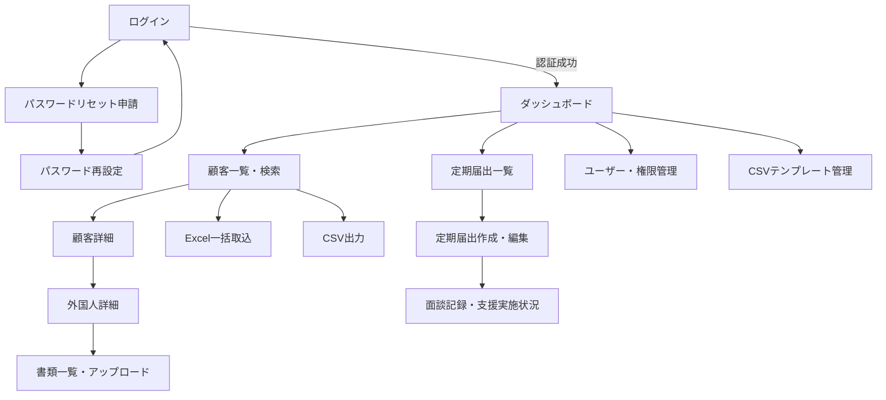

# 画面一覧・画面遷移

## 1. 画面一覧

| # | 画面名 | パス（予定） | 対応Phase | 主なロール |
| --- | --- | --- | --- | --- |
| 1 | ログイン | `/login` | Phase3 | 全員 |
| 2 | パスワードリセット申請 | `/password-reset` | Phase3 | 全員 |
| 3 | パスワード再設定 | `/password-reset/[token]` | Phase3 | 全員 |
| 4 | ダッシュボード | `/dashboard` | Phase4/8 | 全員 |
| 5 | 顧客一覧・検索 | `/clients` | Phase4 | admin/staff/viewer |
| 6 | 顧客詳細（法人・外国人・在留資格） | `/clients/[clientId]` | Phase4 | admin/staff/viewer |
| 7 | 外国人詳細（在留資格履歴・書類一覧・アップロードを含む） | `/clients/[clientId]/foreign-nationals/[id]` | Phase4/5 | admin/staff/viewer |
| 8 | Excel一括取込 | `/clients/import` | Phase4 | admin/staff |
| 9 | 書類一覧・アップロード（外国人詳細画面に統合） | `/clients/[clientId]/foreign-nationals/[id]`（同上） | Phase5 | admin/staff/viewer |
| 10 | 検索結果CSV出力（単純出力） | `/api/clients/export` | Phase4 | admin/staff |
| 10b | 入管提出用CSV生成（テンプレート+検証） | `/clients/csv-generate` + `/api/clients/csv-generate` | Phase5 | admin/staff |
| 11 | 定期届出一覧 | `/reports` | Phase7 | admin/staff/viewer |
| 12 | 定期届出作成・編集（差分入力） | `/reports/[id]/edit` | Phase7 | admin/staff |
| 13 | 面談記録・支援実施状況 | `/reports/[id]/support` | Phase7 | admin/staff |
| 14 | ユーザー・権限管理 | `/settings/users` | Phase3 | admin |
| 15 | CSVテンプレート管理 | `/settings/csv-templates` | Phase5 | admin |

## 2. 画面遷移概要

## 3. UI方針

- ナビゲーションはサイドバー + ヘッダーの2階層のみとし、階層を深くしすぎない
- 一覧画面は「検索条件」「一覧テーブル」「一括操作（CSVダウンロード等）」の3ブロック構成に統一する
- 入力フォームはセクション単位（法人情報/外国人情報/在留資格など）に分割し、長大な1フォームにしない
- スマートフォンでは一覧をカード表示に切り替え、横スクロールテーブルを避ける
- ライト/ダークモードは共通のCSS変数（`--background`, `--foreground`, `--primary`等）で切り替える
  （実装基盤は[02_architecture.md](./02_architecture.md)参照）
